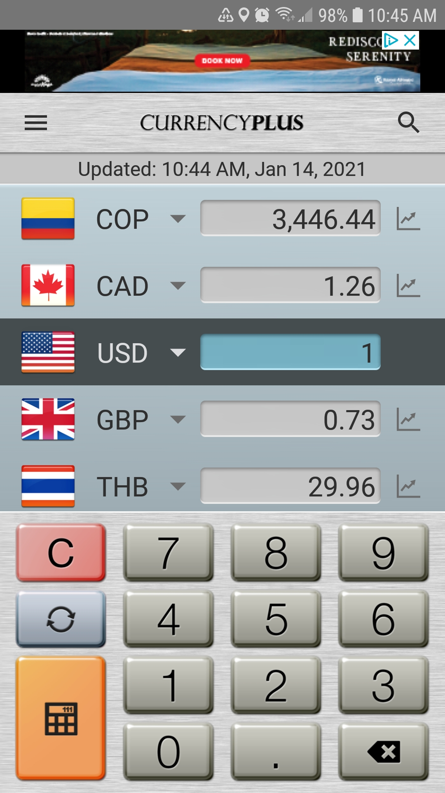
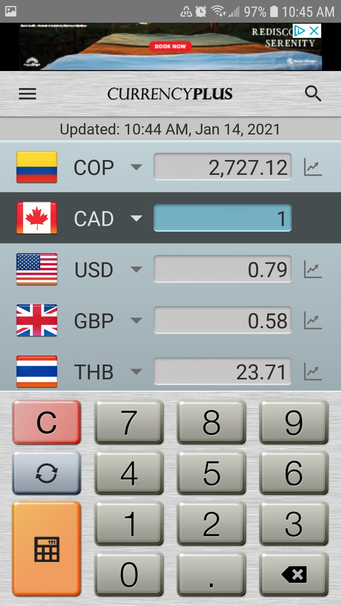
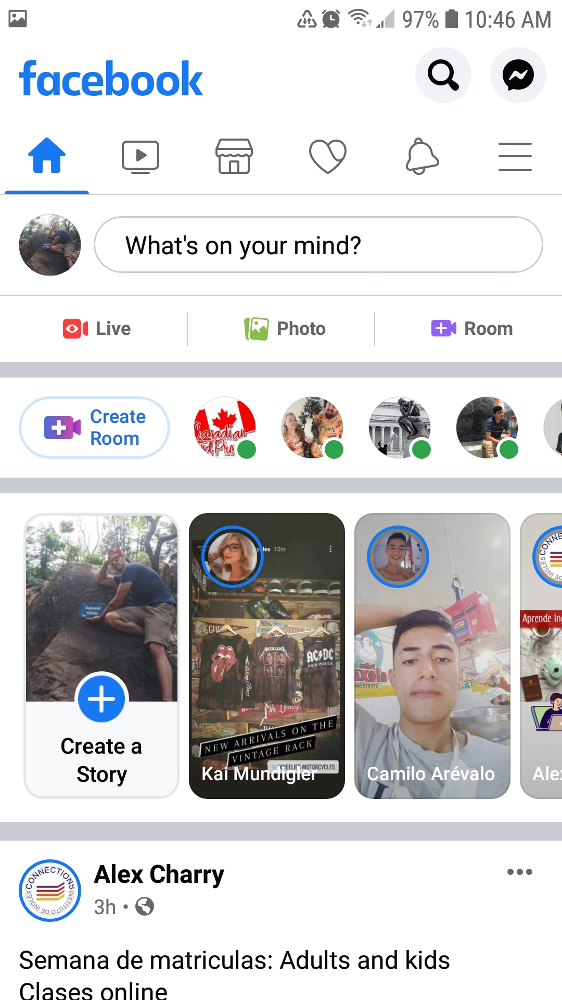

# DGL-114 Process Portfolio
## <ins> Intro to App Development </ins>
### By Zak (zakacat) Toews

#### Activity 0101:

_"Find one example of a mobile app that has an interface that you consider 'good', and one example of a mobile app that has an interface that you consider 'poor' (or, if not poor, at least 'difficult'). Take some screenshots that highlight the best and worst of each app and provide a short description in your Process Portfolio justifying your choices."_

Good Interface - Currency Plus

- I like how this app always has the number input  widget open.
- This app is really straight-forward. Choose the currency that corresponds with the flag of the country from the drop down list. Click the text field and input the amount, the other currencies update in real time. There is no need to press any button to get the computation.
-Near the top, there is information for when the values of the currencies were last updated which is important info for a currency conversion app.

Bad (confusing) Interface - Facebook

- I find the Facebook and the Facebook app have become more and more cluttered and confusing over the years as they are trying to adopt features that their competitors have.
- I have confused the "What's on your mind?" text field with search on several occasions. Maybe because an open text field near the top of an app is usually for something specific or search?
- I do not want to see this room feature and I don't know an easy way to get rid of it.
- I prefer how the story feature works in other apps, where either it is hidden on a different screen or it is collapsed to just the icon representation of the person without a preview of their story.
- The app could maybe benefit from a builder tool that could quickly rid the UI of elements that the user doesn't want?

#### Activity 0102:

_"Consider what it means for a mobile interface to be 'usable'. What types of things do you expect to find in an app that is considered 'intuitive'? Make a list of as many 'usable' and 'intuitive' elements as you can think of (Hint: Don't restrict yourself only to buttons and widgets!)"_

- Items having to do with orientation should be at the very top (Home, About Us, Search, Help, etc.) or sometimes at the very bottom.
- Intuitive apps are designed in such a way that usually the first attempt by the user to do something is the correct way to carry out that action.
- Number fields should automatically open a num-pad or calculator.
- Text fields should accept a large range of input or at least warn the user that their input is not acceptable.
- Phone apps especially should avoid clutter. The screens are too small and our thumbs are too big to deal with small text/buttons/widgets.
- Apps should load quickly or inform the user in some way that it is loading so the user doesn't think that the app is broken or that it is frozen.
- Apps should be easily closeable.
- Apps should ask for permissions, and they should also avoid using any unnecessary permissions. 
- An app should be easier and quicker to use than its web counterpart.
- I think for almost all software that we are interacting with these days, that giving feedback should be really easy to do (I like how easy it is to give feedback on our course on ZyBooks). There could be a list kept in the back-end for users who tend to give appropriate feedback.
- Activities or screens should be focused on one task.
