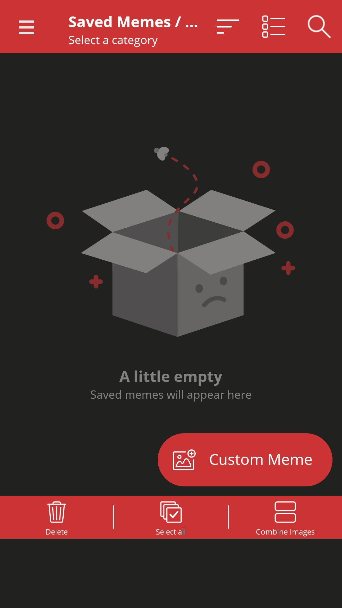
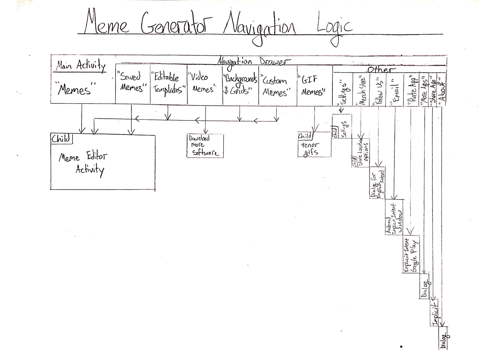

# DGL-114 Process Portfolio
## <ins> Intro to App Development </ins>
### By Zak (zakacat) Toews

### :octocat: Activity 0101:

>_"Find one example of a mobile app that has an interface that you consider 'good', and one example of a mobile app that has an interface that you consider 'poor' (or, if not poor, at least 'difficult'). Take some screenshots that highlight the best and worst of each app and provide a short description in your Process Portfolio justifying your choices."_

###### Good Interface - Currency Plus

- I like how this app always has the number input  widget open.
- This app is really straight-forward. Choose the currency that corresponds with the flag of the country from the drop down list. Click the text field and input the amount, the other currencies update in real time. There is no need to press any button to get the computation.
- Near the top, there is information for when the values of the currencies were last updated which is important info for a currency conversion app.

###### Bad (confusing) Interface - Facebook

- I find the Facebook and the Facebook app have become more and more cluttered and confusing over the years as they are trying to adopt features that their competitors have.
- I have confused the "What's on your mind?" text field with search on several occasions. Maybe because an open text field near the top of an app is usually for something specific or search?
- I do not want to see this room feature and I don't know an easy way to get rid of it.
- I prefer how the story feature works in other apps, where either it is hidden on a different screen or it is collapsed to just the icon representation of the person without a preview of their story.
- The app could maybe benefit from a builder tool that could quickly rid the UI of elements that the user doesn't want?

### :octocat: Activity 0102:

>_"Consider what it means for a mobile interface to be 'usable'. What types of things do you expect to find in an app that is considered 'intuitive'? Make a list of as many 'usable' and 'intuitive' elements as you can think of (Hint: Don't restrict yourself only to buttons and widgets!)"_

- Items having to do with orientation should be at the very top (Home, About Us, Search, Help, etc.) or sometimes at the very bottom.
- Intuitive apps are designed in such a way that usually the first attempt by the user to do something is the correct way to carry out that action.
- Number fields should automatically open a num-pad or calculator.
- Text fields should accept a large range of input or at least warn the user that their input is not acceptable.
- Phone apps especially should avoid clutter. The screens are too small and our thumbs are too big to deal with small text/buttons/widgets.
- Apps should load quickly or inform the user in some way that it is loading so the user doesn't think that the app is broken or that it is frozen.
- Apps should be easily closeable.
- Apps should ask for permissions, and they should also avoid using any unnecessary permissions.
- An app should be easier and quicker to use than its web counterpart.
- I think for almost all software that we are interacting with these days, that giving feedback should be really easy to do (I like how easy it is to give feedback on our course on ZyBooks). There could be a list kept in the back-end for users who tend to give appropriate feedback.
- Activities or screens should be focused on one task.

### :octocat: Activity 0201:

>_"Choose a mobile app (Android or iOS) that you use frequently. For this activity you will identify features and permissions associated with the app, as defined in section 2.1 of the textbook. Make a list of all features in your chosen app (if you don't know for sure, but try to be complete - you can see a full list of Android features here - scroll to the bottom), and a list of all permissions. For permissions you can check your app permission settings (whether iOS or Android) typically in the Apps or Permissions Manager section of the OS settings."_

###### Chosen App - Adidas Run

**Feature** | **Example**
-------------|-------------
android.hardware.multitouch | This app can recognize several types of gestures including swipes for scrolling and pinch to zoom.
android.hardware.screen.portrait | This app is always displayed in portrait mode.
android.hardware.camera.any | This app is able to exercise either camera as desired to take a picture after an exercise routine. The photo can then be saved to the phone or shared in social media.
android.hardware.camera.flash | This app allows the use of flash when pictures are taken.
android.hardware.audio.output | The app normally doesn’t have any sounds but when you are in an exercise, the app can inform you audibly for increments of time or distance with a pre-recorded voice (my “Voice Coach” is still in Spanish).
android.hardware.type.watch | As this is a fitness app, it is compatible with a smartwatch (preferably an Adidas smart watch).
android.hardware.wifi | This app can use WiFi for any function that requires network connectivity.
android.hardware.location.gps | This app will use GPS apparently; however, I noticed when my SIM card was disconnected, my location tracking became too unreliable to be useful.

**Permission** | **Severity** | **Example**
----------------|--------------|-------------
Location | Potentially Dangerous | I solely use this app to track my km’s when running, so this is a necessary permission.
Microphone/ Record Audio | Potentially Dangerous | I am not sure why this app wants this permission. It is not required and I have it deselected.
Contacts | Potentially Dangerous | I am not too sure why the app needs my contacts, but some apps will generate friends or recommendations from the contact list. I also have this deselected.
Camera | Potentially Dangerous | This one makes sense as I use it sometimes to pair a photo with my workout.
Storage * | Potentially Dangerous| The app can alter my storage and store photos and workouts.

*As a note, the read/write storage permission is an almost mandatory permission for all apps and has only been enforced since API 19 ([Reference](https://developer.android.com/reference/android/Manifest.permission#READ_EXTERNAL_STORAGE)).

### :octocat: Activity 0202:

>_"Choose a mobile app (Android or iOS) that you use frequently. Pick one screen in the app and identify elements of the Model, View and Controller in that screen. In other words, list out all View elements (i.e. everything you can see on screen), all Model elements (i.e. all data relevant to that screen) and all Controller elements (i.e. all the possible interactions on that screen that may modify the Model or View)."_

###### Chosen App - Voice Recorder

**View**

* Primary color is Grey
* Secondary color is Black
* Text color is White

**Controller**

*Some of these points are speculation.

* Record/ Stop button starts or stops the recording of the audio file when button is pressed. Button alternates. It becomes a record button when the user opens the app or after a recording has been stopped. When a recording is taking place, the button becomes a stop button.

* All Text fields are adjusted accordingly for the user as the recording continues. Storage decreases while elapsed time and file size increase.

* Pause/ Play button pauses the current recording or plays the last recorded file when button is pressed. When the record button is pressed, the pause button appears on the right side, when the stop button is pressed, a play button appears on the left side.

* Navigation buttons switch screens accordingly and also display as a red button when the navigation button ¬matches the accompanying screen.

* Visualizer displays a live visual representation of the audio wave intensities being received (could be pseudo, but it is believable).

* Controller must call a new instance of a record file object every time the record button is pressed.
There are no extra preliminary input fields… so probably no parameters for the record file object… though I am not certain.

* Controller requests info (calls getter methods) from the model so it can update the text fields.

**Model**

*All these points are assumptions.

*I wrote this as a computation flow, not as a description of the class contents.

* A record file object is instantiated.

* Variables are instantiated for file size and duration of recording.

* A method is called that uses the microphone to listen.

* Duration and file size increments in real time.

* Empty storage value is retrieved from somewhere and updated against the current audio file size (As audio files are quite small, and my storage in quite large (to only 1 decimal place), I am not sure if this value is updated in real time or not, but I imagine it is).

* A stop button selection reported from controller will call a method to stop the recording.

*I suppose the file size, duration, and storage info could be handled in the controller and it might be easier to use a recording class from the library and only have to make the controller from scratch.

### :octocat: Activity 0203:
*I understand that only two activities per week are necessary, but I would like to do three if I can when I have the time.

>_"Visit material.io and examine some aspects of Material Design. Scroll through the site and take a look at one page/article that interests you in more detail. Summarize what you learn from the article in your Process Portfolio."_

The article that I chose was Text Fields ([Source](https://material.io/components/text-fields/android)). I chose the implementation section instead of the design section as that is what I am more concerned with. Although I know design is important for a polished, highly-usable app, I feel I should focus on how to use the feature first.

###### Summary of Text Fields Implementation

* Firstly, apparently, a dependency needs to be made.
* The API supports both label text and helper text in addition to the edit text and the use of both is recommended.
* You can set descriptions of icons and errors so that apps that read the screen can interpret what is being displayed. (I am thinking like apps designed for the visually impaired or maybe a translator).
* If you are using a Custom edit text, you can define accessibilities (I am not too certain what that means).
* You can add start and end icons into the text field. They can be strictly visual or they can increase functionality. The example is the hide/show password icon that can be selected to hide the text as the user types it into the text field.
* You can also create custom icons and use them. There are more directions on the website on how to modify the behaviour of the custom icon.
* You can add a character counter to the text field.
* You can add errors to the text field (which look to display in the helper text by default)
* You can add prefixes and suffixes to the text field.
* There are two types of text fields, filled and outlined
* You can also apply themes to the text fields.

*There is soooooo much useful information in here. I will definitely be back here, probably for the final assignment or maybe past that if I decide to continue with app building.

### :octocat: Activity 0301:

>_"Choose a mobile app (Android or iOS) that you use frequently. Do your best to identify all the activities (or 'screens') in the app and write them down in your Process Portfolio. See if you can come up with some meaningful way to categorize all screens. (Note that some screens in some apps may have tabs and menus, etc. I'm looking here just for the screens themselves - so any time there is a clear full screen change in the app. Additionally, note that in iOS we do not refer to these as 'activities', but more commonly as 'views'. For the purposes of this activity the distinction is not too important)."_

###### Chosen App - Adidas Run

###### Activity

The main activity is called Activity and it shows that it is selected at the bottom on the navigation bar. This activity includes a simple set-up to start recording your work out. It also displays information about the work like duration and GPS location.

###### Music & Story Running

Clicking the music icon brings up an activity to modify settings related to music that you can listen to while you workout.

###### Activity Setup (General Settings)

Clicking the sprocket icon (as usual) brings up the general settings activity. This is where you can change the activity type, imperial to metric, voice coach, and many other settings.

###### Community

Clicking the community button in the navigation bar opens the activity for interacting with the social media aspects of the app. There is also and option to connect with Facebook friends which might open up a certain activity in the Facebook app.

###### News Feed

Clicking the news feed button in the navigation bar opens an Instagram-like post scroller for your activities and activities of friends or people you follow.

###### Progress

Clicking the progress button in the navigation bar opens the activity for goal setting and stats.

###### Profile

Clicking the profile button in the navigation bar opens the activity for adjusting the information in your profile and image.

###### Re-Categorization

If I were to generally Categorize these, I would separate them into 2 sections of settings (or customizability) and function. It could be maybe 3 categories as settings, function, and social media. I think this might be more appropriate as the main function of this app is to record work outs, but a secondary function is to be able to share it.

### :octocat: Activity 0302:

>_"Choose a mobile app (Android or iOS) that you use frequently and consider some of the more common Android event types are discussed in chapter 3.1 of the textbook. Which of these events does your app use? List a few different instances for each event in your app. Can you think of other events that your app might use that are not discussed in chapter 3.1?"_

###### Chosen App - Adidas Run

*Events used :*

onClick()
* this app uses the click to navigate thru almost the whole app

onLongClick()
* long clicking on the output values for the exercise allow the user to customize which information is displayed.

onTouch()
* After the GPS is selected and expanded to take up the whole screen, the user can use the pinch gesture to zoom in or out of the map

### :octocat: Activity 0303:

>_"After reading chapter 3.5 - Table, Grid and Frame Layouts visit material.io and do a search for one of 'table', 'grid' or 'frame'. Choose one of the articles in the search results that most closely relate to what you learned about tables, grids or frames from chapter 3.5 and read through it. Summarize what you've learned in your Process Portfolio."_

I chose the article about spacing methods ([Source](https://material.io/design/layout/spacing-methods.html)). Hopefully, this will explain a bit about what the jargon represents and how spacing affects the display on different devices.

* All components align to a 8dp square baseline grid
* Icons, type, and some elements within a component align with a 4dp grid.
* Type (Text) aligns to a 4dp baseline grid, but this can easily be overridden if the type is within
any components
* Spacing methods
	* Padding = the space between elements in a component
		- measured in increments of 4dp or 8dp
		- measured vertically and horizontally
		- does not need to span the whole height of the layout
	* Dimensions = describe the width and height of a component
		- Some components only have a height dimension as they are designed to fit the width of a view port.
		- Component dimensions tend to follow the 8dp grid baseline
	* Alignments = the placement of elements in a component
		- Keylines are established when elements are placed out of the 8dp grid
		- Keylines can be used to consistently line up other elements
		- Keylines can be adjusted to create more or less space between elements
* Containers are adjustable shapes that are used to hold UI elements like text or buttons.
* To maintain consistency of the layout, try to use consistent aspect ratios .
* Flexible ratios can be used with containers to match columns and image height.
* Touch targets (is the interaction area of a touch UI element) should be 48 x 48dp with 8dp padding to make it easier to press the item, I suppose.

### :octocat: Activity 0401:
>_"Choose a mobile app (Android or iOS) that you use frequently. Characterize the app's navigational model by examining how the user traverses through different activities (i.e. 'screens') in the app. Is the navigational model flat? (Meaning all activities have the same level of importance, perhaps each activity is accessible by swiping left or right?) Is there a hierarchical relationship between activities? (Meaning, is there a central, or main screen from which all other activities are accessed?) Discuss your findings in your Process Portfolio."_

###### Chosen App - Meme Generator Free

* The Main Activity displays the meme formats in a tile display. Though the user can swipe left and right, it does not start new activities, instead it cycles through different organizations of the memes. New is automatically displayed onCreate(), and the User can swipe through Favorite, Popular, etc.

* The Memes Activity IS the Main Activity and from there the other activities can be selected, and it is a two step process. The user must click the Navigation Drawer and then they must click which activity they would like to open. This is probably a good plan when design is less of a concern than functionality and the large majority of the actions in the app will be started in the Main Activity.

* The Navigation Drawer directs the user to different activities which are organized into two categories, Create Memes and Other.

* The Create Memes category is positioned higher in the overflow list, so it appears to have a higher importance or at least a higher relevance.

* It should be noted that when a meme is selected, a new activity is opened that has a larger version of the meme with various edit options.

### :octocat: Activity 0402:
>_"After reading chapters 4.3 - Multiple activities and intents and 4.4 - Implicit intents of the textbook choose a mobile app (Android or iOS) that you use frequently and characterize all possible uses of intents in the app. Which other apps can be opened from your chosen app? Be thorough, and make sure you identify all possibilities. (Note that we do not refer to these as intents in iOS, but the distinction is not important here)."_

###### Chosen App - Meme Generator Free

* Categorically, the Create Memes options in the Navigation Drawer call internal intents (explicit intents for other activities in the same application).

* Saved/Memes/ Combine, Editable Templates, Video Memes, Background & Grids, and Custom Memes all start their appropriate in-app activities.
*	In the Other section of the Navigation Drawer is where many actions that use intents for external applications can be found.
*	There are several examples of implicit intents or actions that attempt to open activities in other already installed applications:

* The email option recommends several applications in which to complete the action and, as expected, extra information is include. With the intent is included, the to address and subject.
(This extra information is called Activity Startup Data and it can be added as a URI in the Intent constructor parameter or it can be added to the intent with the .putExtra method)

*	The Rate App option is an example of explicit intent as it directly opens the google play store activity for rating this app. It appears that the Activity Startup Data contains the exact information for finding this app in the google play store.

*	Share App option is an implicit intent that generates several different social media messaging app options that are available to complete the action.
*	The GIF (pronounced with a hard G) Memes (Pronounced not like a crazy person) option in the Create Memes Category has an explicit intent which opens the Tenor gifs activity, but I am not sure if this is part of the Meme Generator app or if it is external.

### :octocat: Activity 0403:
>_"After reading chapter 4.5 - App Bar visit material.io and read the article App bars: Bottom. After reading the article summarize the differences between the use of top and bottom app bars in your Process Portfolio."_

**TOP** | **BOTH** | **BOTTOM**
--------|----------|-----------
Top Bars are considered with the principles of Persistent, Guiding, and Consistent| Both bars should locate the navigation drawer on the far left (but only on one of the bars at a time if the app is using a top bar and a bottom bar such as Instagram)| Bottom Bars are considered with the principles of Actionable, Flexible, and Ergonomic
There are two _types_ of top bars to consider, regular bars and contextual bars (bars that pop up to help execute certain actions based on context)| Both bars can contain an Overflow Menu and Action Items which are normally located on the right (while using a FAB on a secondary screen, the action icons are on the left and the navigation drawer disappears)|It is common to have a Floating Action Button (FAB) on a bottom bar.
A top bar can contain a title (or an action name in the case of a contextual bar)|Both bars can be hidden in relation to scrolling (where scroll direction affects when and how the bar is hidden)|When debating which action buttons should be placed where, most common actions should be placed where they are the easiest to access… at the bottom
Two heights are available for mobile. Regular and Prominent| The overflow menu should be the last option on the right whether it is a top bar or a bottom bar| Bottom bars should be covered by temporary surfaces
It is common to display images in a Prominent style top bar background as long as they don’t interfere with the visibility of the icons or text|:octocat:|:octocat:
When debating which action buttons should be placed where, destructive actions should be harder to reach and thus on the top bar|:octocat:|:octocat:

### :octocat: Activity 0501:
>_"Choose a mobile app (Android or iOS) that you use frequently. For this activity you will characterize the app's navigational model (similar to activity 0401), but in this case you will draw a diagrammatic representation of the navigation. You may use the same app chosen for activity 0401. Include an image of your drawing in your Process Portfolio and briefly describe what you have learned from this activity."_
###### Chosen App - Meme Generator Free

Refer to Activity 0401 for more images of the app.

**Figure 0501.1 Meme Generator Navigation Logic**

I have learned through this exercise, that this app is a bit difficult to follow. The categories make sense but only after speculation. This app could/could’ve probably benefit/ed from more layout design. There are a couple way that I would improve the layout.  I think I would try to organize the activities that lead to the Meme Editor together and in their own category. They could have used tabs, but the tabs are used to scroll horizontally through the different orderings of the meme lists (Top, popular, new, etc.). This app is not as clean overall as I would like it. The “Merch Store”, “Email”, “Rate App”, “More Apps”, and “Share App” would probably be better suited hidden away in “About” with “About” having a child activity as opposed to a dialog. “Video Memes” and “GIF Memes” are better suited in an extra category as they don’t quite fit with the other activities of similar importance.

### :octocat: Activity 0502:
>_"After reading chapters 5.5 -Handling touch and 5.6 -Touch gestures choose a mobile app (Android or iOS) that you use frequently and list all touch events and touch gestures used in the app. Be thorough and make sure you consider testing events and gestures you might not commonly use. Feel free to check your app's 'how to' manual (if such a thing exists). Summarize your findings in your Process Portfolio."_

###### Chosen App - Adidas Run

**TOUCH EVENTS**| **EXAMPLE**
----------------|-------------
Tap | Tap is equivalent to a mouse button click and is the basis for all user interaction in mobile apps.
Double Tap | N/A :octocat:
Long Press | This event is usable on the text views that display the workout stats. It allows the user to change the metric this is displayed in each text view.
Scroll | This is used to scroll vertically through any of the activities that need to be scrolled through. For example, “Activity Setup”.
Pinch & Spread | These two events are used to zoom in and zoom out of the map that displays the user’s location.
Drag | This event is used to move that map. It a useful gesture as the user does not need to zoom out again to see other areas of the map.
Fling | N/A :octocat:

### :octocat: Activity 0503:
>_"After reading chapter 5.3 -Dialogs visit material.io and read the article Dialogs. As you read carefully consider when the use of dialogs is appropriate. Summarize your findings in your Process Portfolio."_

Dialogs in general are designed to force the attention of the user to critical information. The term used in the article for dialogs is modal window as the dialog is a child of the activity behind it.

There are four categories of dialogs according to the material.io:

* Alert Dialogs are meant to be used when information is important and the user should be interrupted from continuing. Alert dialogs should be used sparingly as they are meant to convey the most crucial of information. Overusing the alert dialog format might cause the user to ignore alert dialogs over time.

* Simple Dialogs are meant to display a list of items that will affected by the user’s recent/current decisions. This a good alternative to an alert dialog as it simply informs the user of the changes that have or are about to occur.

* Confirmation Dialogs are meant for decisions. They can replace in-screen selectors like radio buttons. A choice should be confirmed before the dialog disappears. Confirmation dialogs are similar to simple dialogs but require a confirmation button to be pressed. A negative action button should also be included.

* Full Screen Dialogs are meant for a series of tasks. Full screen dialogs are the only type of dialogs that can display another type of dialog. Full screen dialogs take up the full screen, and they should be used with dialogs that use a keyboard or when the changes aren’t instantly saved. In my opinion, Full Screen Dialogs look like a great alternative to new activities.

### :octocat: Activity 0801:
>_"Choose a relatively complex mobile app (Android or iOS) that you use frequently. For this activity you will characterize the app's data storage capabilities. Write down one example of each of the data storage strategies listed at the top of section 6.1 of the text. You may have to guess for some things, but try to identify data that you can for sure say belongs to each of the five strategies (e.g. it is pretty obvious that an app uses cloud storage as a strategy if your content is available on both your device and on your desktop)."_

###### Chosen App - WhatsApp

*For maybe not-so-obvious reasons I haven't included any screenshots as they would contain predominantly private information of myself and my contacts.

**STORAGE TYPES**| **EXAMPLE**
----------------|-------------
Shared Preferences| I am uncertain of the private values, but the things that might be stored in shared preferences are like night mode, read receipts, status, and privacy settings for personal information. |
App-Specific Files| I imagine that there is a plethora of local private files for WhatsApp. Data that might fit into this category could be a database of time zones to automatically convert the time stamps on messages.|
Shared Storage| Most of the audio, video, and photos appeared to be stored locally to the device and to the cloud (to be accessed by another device). These files are accessible thru the gallery of my Samsung device which also means it is accessible to other apps with proper permissions.|
Database| From what I gather, the app only holds recent information to be immediately accessible in the app. Older messages or media is stored within a local database as well as in the cloud. These databases can be deleted from the local device to free up space if needed.|
Cloud| This app holds most of it’s information or at least a cache of the information online somewhere in the cloud. Nothing appears to be easily delete-able with these kinds of apps.|

### :octocat: Activity 0802:
>_"To-Do List uses app-specific storage to store a text file made up of all to-do list items. Now imagine a more 'advanced' version of To-Do List and using the data storage strategies presented in section 6.1 as a guide, list other types of data that the 'advanced' To-Do List might store. Make sure to identify at least one type of data per strategy."_

**STORAGE TYPES**| **EXAMPLE**
----------------|-------------
Shared Preferences| The app could store specific information like an opening message for the note or whether to show the list with numbers, bullets, or letters.  |
App-Specific Files| If the user would like to make personal notes or maybe store crucial information with the to-do list app, maybe this info could be encrypted and stored locally.|
Shared Storage| There could be a screenshot/photo option built into the app that could save the list to the gallery on the phone. Other apps (like social media) would then have access to it. |
Database| As well as syncing the date with the lists taken, it is possible to organize the list with a calendar and have them stored in a database locally.|
Cloud| To-Do List Super Ultimate Edition ™ could have an external pad that connects to Wi-Fi and has a magnet on the back so that the user can make notes by hand like a grocery list in the kitchen. This list then uploads instantaneously to the cloud and syncs with your phone, uses GPS location tracking to remind you to buy the groceries when you are at the local bakery, Walmart, butcher, etc…|

### :octocat: Activity 0803:
>_"After reading chapter 6 visit  material.io and read the article Lists. Consider the list in the To-Do List app. Does it meet the expectations of Material Design? Summarize your findings on your process portfolio."_

**DIDS**| **DIDN'T DOS**
----------------|-------------
The list is organized into a single column of many rows.|	There are no spacing or line breaks that can lend to easier reading.|
The layout in consistent for single line entries.|	For more than a single line entry, when the information overflows into two or more lines, the text does not line up properly, this makes it a bit confusing to read. |
The list is organized in numerical order. |	There is no limit to the amount of lines. I suggest an ellipsis with an opportunity to drop down the extra lines, so that the single line format can be kept. That or there can be a max character count for the input (which is way easier to implement).|
:octocat:| 	The list contents are not moveable, which would be nice especially if we are to use numbers to organize the list.|
:octocat:| A meta-action to delete the single item would be nice as well.|
:octocat:|Spacing specs for single line list was not adhered to.

### :octocat: Activity 0901:
>_"After reading section 7.2 in the text (and implementing all related code) take a read through the article Save data in a local database using Room on Android Developers. Based on your understanding developed in the textbook and from the Android Developers article, write a paragraph or two on your process portfolio summarizing your understanding of Room, its main components and how they relate to one another."_

First of all, Room is like a wrapper for SQLite in that it is supposed to make the database and persistent data process easier. I suppose because the authors of the text think that we will be using Room more than SQLite as developers, that they only quickly covered the basics of SQLite before moving on to a superior form of local database implementation - Room. Databasing is a new concept to me (one that I think gets covered in detail in CPS 2), but it seems to obviously be an important and powerful tool so I will try my best to understand it.

Room consists of 3 main components:

1.	**The Database Class** that holds the database and acts as the access point between the app and the local persisted data.

		- The app interacts directly with the database by retrieving instances of the Daos with the current value attributes (I think…).

2.	**Data Access Objects (Dao)** that provide methods for the app to interact with the database. (As opposed to DOA which means you probably have a null pointer exception, har har)

		- The app interacts directly with the Daos by retrieving entities (which represent tables and rows) from the database and the app can also update the Daos with update information in the database. Daos provide the methods needed for the app to use to interact with the database.

3.	**Entities** that represent the tables within the database.

		- The app interacts with the entities by getting and setting the field values, then using a Dao to send that info to the database. Each new instance of a specific entity represents a row in a table of the same entity type.

### :octocat: Activity 0902:
>_"The Study Helper app uses Fragments (which we aren't using in detail in this class). Fragments are a powerful (but complex) tool in Android Development. To get a better sense of what Fragments are and why you would use them read the Fragments and the Create a fragment articles on Android Developers and briefly summarize what you've learned on your process portfolio."_

Fragments are similar to Activities in that they have their own life cycle, can use pre-established layouts, and can handle their own inputs.

Fragments provide the developer with a way to use modularity to their advantage. Fragments are preferable when the developer wants to manage the UI of a single screen or portion of the screen.
Fragments can be added, modified, and deleted during runtime (as interactions with the user). As a developer, you can reuse the same fragment class with multiple instances to help reduce the amount of work and rewriting that might be needed otherwise. A single instance of a fragment should have the logic necessary to manage its own UI.

To implement a fragment, certain steps must be followed:

1.	Add repository and dependencies to build.gradle (see https://developer.android.com/guide/fragments/create).

2.	Create a class that extends Fragment or specialized children of the Fragment class such as
DialogFragment and PreferenceFragmentCompat.

3.	Add the fragment to a fragment-friendly activity. Extending AppCompatActivity creates a fragment-friendly activity.

4.	Coordinate the fragment with a view (it is recommended to use a FragmentContainer view as it is more optimized for fragments)

\*	A fragment can be added programmatically by using Fragment Transaction.

\*	Bundles can be used to pass information in at the start of the fragment creation.

### :octocat: Activity 0903:
>_"Visit material.io and read the article Cards (make sure you have the Design tab - and not the Implementation tab - selected). Consider the cards used in the Study Helper app: How could they be improved, based on the recommendations in the Cards article? Summarize your thoughts on your process portfolio."

Ways to improve the cards of the in the Study Helper app:

-	The cards could include rich media to make them more visually appealing. (A picture with formulas for math, pyramids for history, Neo from the matrix for programming)

-	Clicking on the cards currently directs the user to a new activity for the questions. It would be nice if the questions were also displayed on cards with a button to expand to see the answer for the question. Also to include all the question cards (flash cards) in a linear style, following the design suggestions on material.io, only having one scroll view activated in mobile view.

-	Setting an elevation to the cards would look nice too as they just look like buttons with rounded corners at the moment.

-	It would be nice to have a way to view the cards by importance where the user can ‘pick up and move’ the cards and save the relative importance of the categories.

-	The hypothetical question cards could maybe include a toggle for something like if a question is understood or not. The view could then organize the questions simply by questions that are not understood first and questions that are understood at the end. Or actually, a swipe left or swipe left gesture system might work better. Swipe left = not understood, and the question is recycled or sent to the bottom of the list. Swipe right = understood, and the question is sent to the very bottom of the list.

### :octocat: Activity 1001:
>_"After reading sections 8.1 and 8.2 consider the types of tasks in an app that would necessarily be asynchronous (this may also require considering a particular type of app). Create a list of at least 10 asynchronous tasks that you might typically expect to see in a wide variety of apps - do some research if necessary. Write your list and summarize your findings on your process portfolio."_

**ASYNCHRONOUS TASKS** | **EXAMPLE APPS**
-----------------------|-----------------
Downloading more information | Reddit is Fun / Facebook / Instagram
Updating Software | Google Play / Samsung/ Android
Playing Music | Samsung Music / Spotify / Itunes
GPS Tracking | Uber / Adidias Run / Tinder
Step Counting | Adidas Run / Fit Bit App /
Background Clock | Alarm Clock / Calendar
Updating Emails | Outlook / Gmail
Updating Messages | WhatsApp / Messenger / Discord / Slack
Updating Notifications | Facebook / Instagram / YouTube
Audio Recording | Voice Recording / Phone / Messenger
Compiling | Power Director / YouCut / YouTube

### :octocat: Activity 1002:
>_"Notifications are added to the Timer app in section 8.5 in the text. Read through the Notifications Overview article on Android Developers to get a sense o the breadth of possibility with notifications. Use your process portfolio to summarize some of the main concerns you should consider when implementing notifications in your app."_

There is actually quite a lot of customizability that can be done with notifications especially in the higher API levels. I think the largest concerns that come with notifications are first privacy, and then abiding by how the user wants to be notified. Setting the notifications is a bit complicated, but there are many settings that can be adjusted.

**Regarding privacy we must consider:**
-	Should the notification be shown on lock screen or not?
-	How much information should the notification display?
- Could the notification information potentially be sensitive information?

**Regarding notification properties:**
-	Should there be a head-ups notifications?
-	Should there be an audible notification?
-	Should there be a light notification?
-	What channel does the notification belong to (above a certain API)?
-	What icon should be used in the status bar?
-	Should a notification dot be shown or not?
-	Is the notification expandable?
-	Can the user interact with the notification with buttons, gestures, or text input?

### :octocat: Activity 1101:
>_"Chapter 9 presents a variety of animation types for various purposes. Use a table on your process portfolio to enumerate all animation types presented and to briefly describe each."_

#### **Animation Types & Description**

**Frame-by-Frame** - Displays a list of images in quick succession

**Tween** - Performs a series of digital transformations on the image/s

-	**View Animation** - A tween animation used on a View object. An animation resource for a view animation is stored in a res/anim.

-	**Property Animation** - A tween animation that changes the property of an object over time. A property animation can modify more properties than a View animation. Uses a time interpolator to affect how the object animates over time. Contains 3 main tools for implementing animation:		

		*	**Value Animator** - An object that is used to calculate general values that change over time.

		*	**Object Animator** - A subclass of value animator that provides simpler methods for translate, rotate, scale , and transparency.

		*	**Animator Set** - Used to group animations and how their display is ordered. 		

### :octocat: Activity 1103:
>_"Visit material.io and read the article Understanding motion. Additionally, check out any related articles that you find interesting. What have you learned about the principles of designing for motion in smartphone apps? Summarize your thoughts on your process portfolio."_

Motion can be added to many transitions in many different aspects of the app.

Usually adding more elaborate animation techniques will display a more playful nature via the app. This could be an overall more enjoyable experience, or it could be a distraction/annoyance depending on the type of app. It seems to be business or pleasure that separates theses viewpoints.

Personally, I am quite utilitarian, but I understand the appeal of design and branding. I would like to make an app transition in a basic way, I think, but add animation to convey information and maybe create something playful with the logo or loading screen. I would also like to preserve some of the ram for the user’s other apps...

A button could display an animation of an icon, or it could inflate an activity or dialog from the icon (container transform pattern). Other types of animations to consider are things like feedback elements, loading lists/elements animation, card motion for recycler views, motion to inform the user about types of gesture detection, and motion to inform locations of items (if they are off-screen).

There are several different ways that a developer could customize an app’s animations. They could adjust the speed, path of motion, oscillation, transition pattern, elevation, or stagger.

A combination of motion type and customization can lead to a very dynamic and memorable experience for the user, but these animations should not be implemented thoughtlessly.
